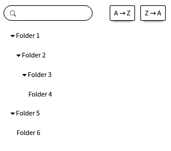

# folderTree
Тестовое задание Wrike
======================
Test Case:
----------
Необходимо реализовать визуальный компонент дерева папок. Успешно выполненным считается задание, соответствующее минимальным требованиям. Реализованный дополнительный функционал позволяет нам увидеть ваши навыки и повышает вероятность попасть на собеседование.

Requirements:
-------------
Нужно получить json файл со списком элементов дерева при помощи GET запроса на адрес https://raw.githubusercontent.com/wrike/frontend-test/master/data.json
Дерево отдаётся в виде массива элементов вида { id: number, title: string, parentId: number }. В дереве отсутствуют циклы.
Корнем дерева является элемент с id = -1.
Нужно отрисовать дерево папок так, чтобы была видна их вложенность.Можно использовать любой фреймворк или писать на обычном JavaScript.

Optional:
---------
Папки можно свернуть/развернуть.
Строка фильтрации. Должны отображать только те папки, поле title которых содержит введенную строку и их родители вплоть до корня дерева.
Кнопки, позволяющие отсортировать папки на каждом уровне по алфавиту. Одна кнопка сортирует названия папок по возрастанию (от A к Z), другая - по убыванию (от Z к A).

